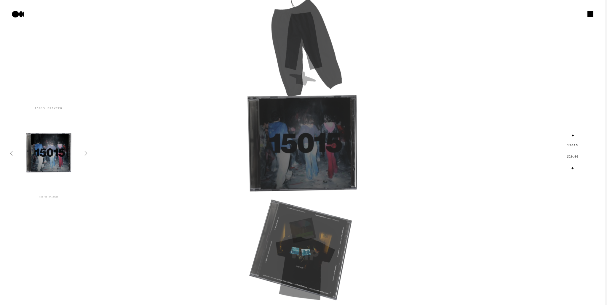
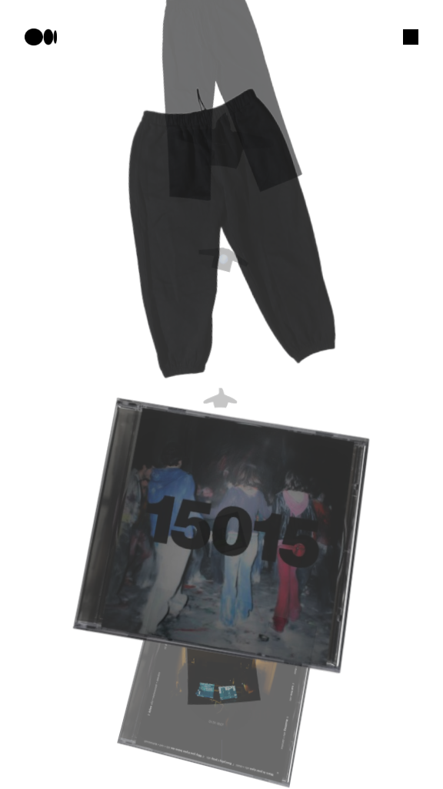
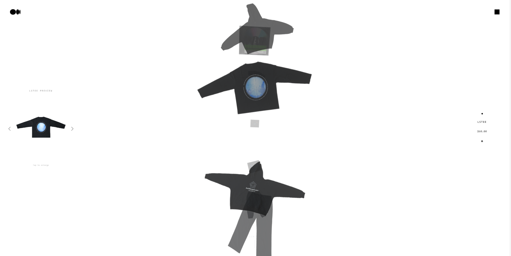
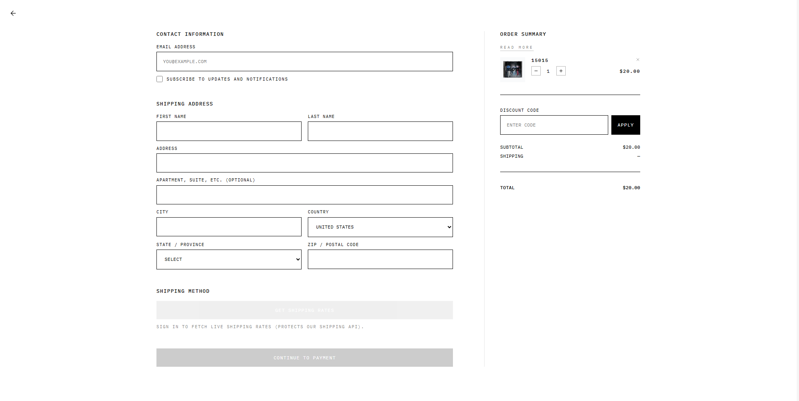

# 15015.shop Private E-commerce Platform

  
  
  

**15015.shop Private E-commerce Platform** is a real production website built for a private codebase and presented here as a public case study.  
This repository is intentionally documentation-only. It shows the product, the system design, and the work behind it without exposing production code or sensitive implementation details.

- **Live demo:** [Live website](https://15015.shop)
- **Source code:** Private, available upon request

> This repository is a public case study and does not contain production code.

## Overview

This project delivers a modern web experience with a public storefront, an admin workflow, and a secure checkout path. The public repository exists for portfolio, recruiter, and client review only.

| Area | Summary |
| --- | --- |
| Frontend | React, Vite, TypeScript, Tailwind CSS |
| Backend | FastAPI, Python |
| Database | PostgreSQL |
| Infrastructure | Linux VPS, Nginx, Cloudflare |
| Payments | Stripe |
| Version Control | Git / GitHub |

## Screenshots

> Screenshot files are placeholders in this public repository.

| View | Preview |
| --- | --- |
| Desktop home |  |
| Mobile home |  |
| Dashboard |  |
| Checkout |  |

## Tech Stack

| Layer | Tools |
| --- | --- |
| Frontend | React, Vite, TypeScript, Tailwind CSS |
| Backend | FastAPI, Python |
| Database | PostgreSQL |
| Payments | Stripe |
| Infra | Linux VPS, Nginx, Cloudflare |
| Workflow | Git, GitHub |

## Main Features

- Responsive storefront experience for desktop and mobile
- Product browsing and collection presentation
- Secure checkout flow
- Order and payment handling
- Admin-side content and catalog management
- Deployed behind a reverse proxy and CDN

## Architecture Overview

This project follows a standard split between presentation, API, persistence, and infrastructure:

1. **Client layer** renders the public website and admin surfaces.
2. **API layer** handles application requests, validation, and business workflow.
3. **Database layer** stores persistent records such as products, orders, and site data.
4. **Payment layer** manages checkout with Stripe.
5. **Delivery layer** runs on a Linux VPS with Nginx and Cloudflare in front of the application.

The implementation details are intentionally omitted here to keep the repository safe for public use.

## What I Built / My Role

- Designed the user-facing website experience
- Implemented the frontend application structure
- Connected the frontend to backend services
- Supported checkout and payment flow integration
- Worked on deployment and production delivery
- Maintained the project through iterations and fixes

## Problems Solved

- Kept the website usable across different device sizes
- Structured the app for production deployment
- Reduced friction in the checkout flow
- Separated public presentation from private implementation
- Kept the public repository safe for sharing with recruiters and clients

## Future Improvements

- Expand reporting and analytics views
- Add richer product filtering and search
- Improve admin workflow speed
- Add more automated testing around UI and checkout paths
- Introduce additional operational monitoring and alerts

## Contact

For a private code review, implementation discussion, or project walkthrough:

- **GitHub source code:** Private, available upon request
- **Live website:** [Live demo](https://15015.shop)
- **Contact:** luccasgamasescolar@gmail.com

---

**Public case study notice:** This repository is meant for portfolio review only. It does not include production code, secrets, credentials, or internal business logic.
